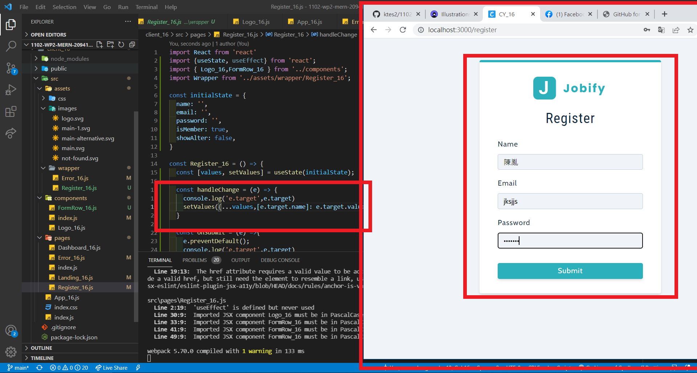

### P1: get a photo from undraw.co using color: var(--primary-500)

### P2: setup routes / for Dashboard, /landing for landing page, /register for Register page

### P3: implement 404 not found page

### P4: Test e.target on Form fields (name, email, password)

